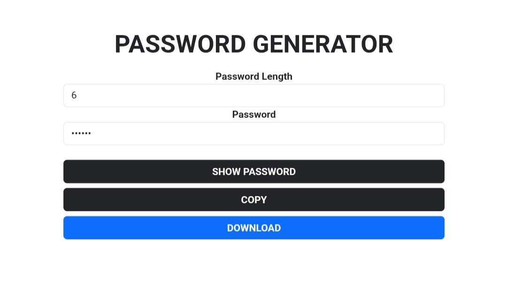

 🔑 Password Generator

**ZPP** (Zikri Practice Project) Series **II**


[](https://github.com/zikri-codes/Password-Generator-ZPP-III/blob/main/LICENSE)


## 📌 Description
A simple project to generate random passwords with customizable length. The password can include lowercase letters, uppercase letters, numbers, and symbols.

## ✨ Features
- **Choose** password length
- **Combination** of lowercase, uppercase, numbers, and symbols
- **Instantly** display the generated password
- **Copy** password to clipboard
- **Download** password into file txt

## 📸 Screenshot



## 📁 Project Structure

```
.
├── README.md            # Project  description
├── LICENSE              # MIT License
├── index.html           # Main project
└── screenshot.jpg       # Gameplay screenshot
```

## 📄 License

This project is licensed under the **MIT License** - see the [LICENSE](https://github.com/zikri-codes/Password-Generator-ZPP-III/blob/main/LICENSE) file for details.
